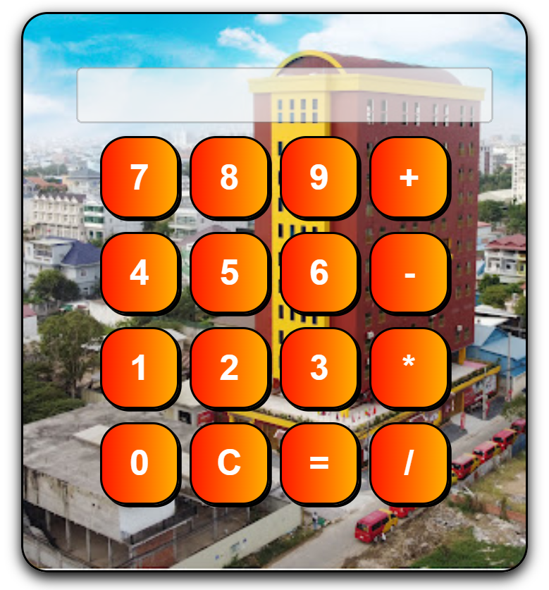

# Calculator App

A simple calculator built with HTML, CSS and JavaScript.

## Features
- Add, subtract, multiply, divide
- Clear button
- Simple UI

## Technologies
- HTML
- CSS
- JavaScript

## Demo
Open index.html in your browser.

## Author
NotChevon-Dev

## img screenshot

